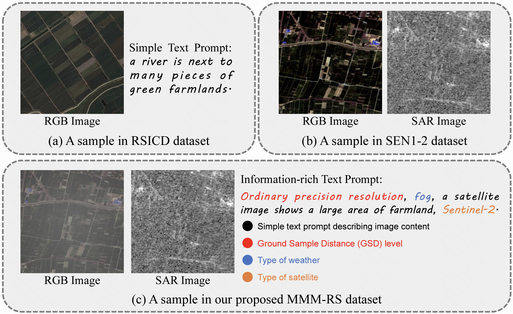
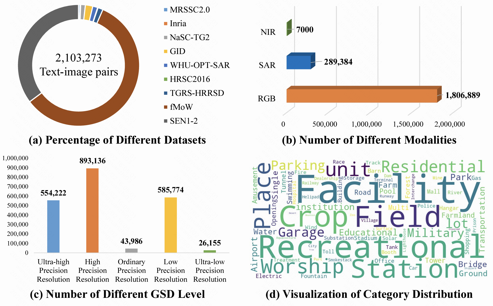

# [MMM-RS Dataset](https://arxiv.org/abs/2410.22362)
# A Multi-modal, Multi-GSD, Multi-scene Remote Sensing Dataset and Benchmark for Text-to-Image Generation (NeurIPS 2024)

[]([http://arxiv.org/abs/2412.11710](https://arxiv.org/abs/2410.22362))


This work provides a multi-modal, multi-GSD, multi-scene remote sensing dataset for text-to-image generation in diverse remote sensing scenarios, comprising approximately 2.1 million text-image pairs.

## Overview of MMM-RS Dataset



## MMM-RS Dataset Statistics



## Dataset Acquisition and Usage

We provide the dataset standardization codes for nine datasets in `./Standardized_processing/`, where each dataset is accompanied by an individual processing code. 
Note that the first line of each code gives the original download link for each dataset, and the users need to download the original dataset before running the codes to obtain the MMM-RS.

For the multi-weather dataset, we provide the processed images in [Google Drive](https://drive.google.com/drive/folders/1Gl1A3PQY4dOW6f7eViWc-V12ehFN7lnd?usp=drive_link), and all annotations are provided in [Google Drive](https://drive.google.com/drive/folders/1Gl1A3PQY4dOW6f7eViWc-V12ehFN7lnd?usp=drive_link) with **JSON** format.
In addition, we also provide a [Baidu Drive link](https://pan.baidu.com/s/1YKH17s-0MnPR8wOIziloVw?pwd=herm).

### Citation
If you find this dataset helpful in your research or work, please cite the following paper:
```
@inproceedings{MMM-RS,
  title={MMM-RS: A Multi-modal, Multi-GSD, Multi-scene Remote Sensing Dataset and Benchmark for Text-to-Image Generation},
  author={Luo, Jialin and Wang, Yuanzhi and Gu, Ziqi and Qiu, Yide and Yao, Shuaizhen and Wang, Fuyun and Xu, Chunyan and Zhang, Wenhua and Wang, Dan and Cui, Zhen},
  booktitle={The Thirty-eight Conference on Neural Information Processing Systems Datasets and Benchmarks Track},
  year={2024}
}
```
