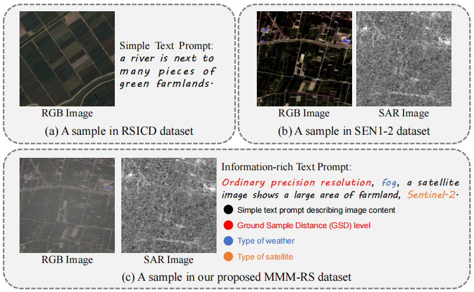
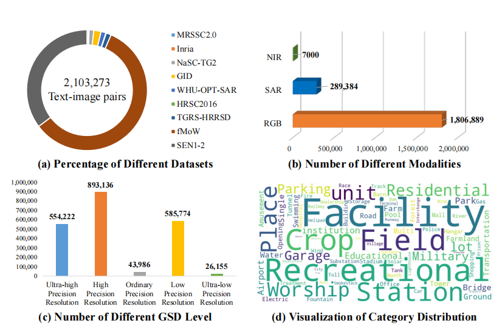
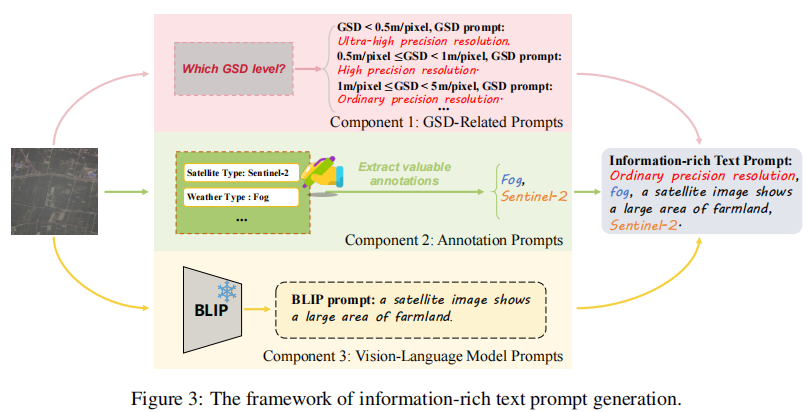
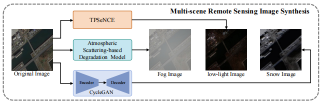
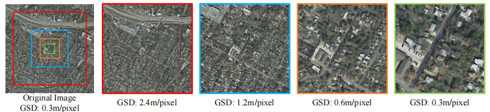
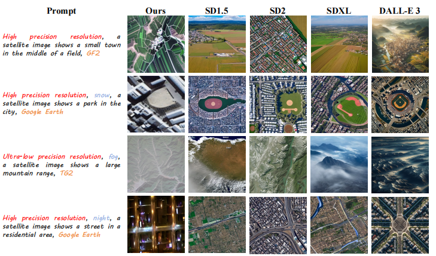
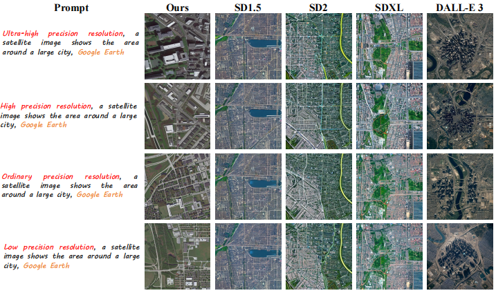
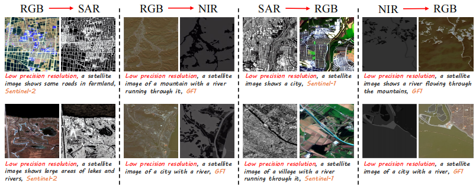

# [MMM-RS Dataset](https://arxiv.org/abs/2410.22362)
# A Multi-modal, Multi-GSD, Multi-scene Remote Sensing Dataset and Benchmark for Text-to-Image Generation (NeurIPS 2024)

[]([http://arxiv.org/abs/2412.11710](https://arxiv.org/abs/2410.22362))


This work provides a multi-modal, multi-GSD, multi-scene remote sensing dataset for text-to-image generation in diverse remote sensing scenarios, comprising approximately 2.1 million text-image pairs.

## Overview of MMM-RS Dataset


## Dataset format
Download the MMM-RS.zip file from the link provided below. The data set directory should look like this:
```
/MMM-RS
├──weather.zip
  ├──MMM-RS_fog_cleaned.json
  ├──MMM-RS_night_cleaned.json
  ├──MMM-RS_snowy_cleaned.json
  ├──night
    ├──xxx.jpg
    ├──...
  ├──snowy
    ├──xxx.jpg
    ├──...
  ├──fog
    ├──xxx.jpg
    ├──...
├──WHU-OPT-SAR.zip
  ├──MMM-RS_WHU-OPT-SAR.json
  ├──WHU-OPT-SAR_dataset
    ├──RGB_jpg
      ├──xxx.jpg
      ├──...
    ├──NIR_jpg
      ├──xxx.jpg
      ├──...
    ├──sar_jpg
      ├──xxx.jpg
      ├──...
├──Inria.zip
  ├──MMM-RS_Inria.json
  ├─Inria_dataset
    ├──xxx.jpg
    ├──...
├──...
```
The weather folder is divided into three weather folders, and the corresponding prompt word json description file. WHU-OPT-SAR and SEN1-2 have their respective modal classification folders and json files, and the remaining folders are a combination of image folders and json descriptions of the prompt words.

### Dataset composition

| Dataset       | Image modality | Image quantity |
|-----------------|----------|---------|
| fMoW            | RGB      | 930,000 |
| TGRS-HRRSD      | RGB      | 21,761  |
| GID             | RGB      | 31,500  |
| NaSC-TG2        | RGB      | 20,000  |
| MRSSC2.0        | RGB      | 6,155   |
| Inria           | RGB      | 2,872   |
| HRSC2016        | RGB      | 1,680   |
| **WHU-OPT-SAR** |          |         |
| WHU_RGB         | RGB      | 7,000   |
| WHU_SAR         | SAR      | 7,000   |
| WHU_NIR         | NIR      | 7,000   |
| **SEN1-2**      |          |         |
| SEN1-2_RGB      | RGB      | 280,000 |
| SEN1-2_SAR      | SAR      | 280,000 |
| **weather**     |          |         |
| snowy           | RGB      | 10,000  |
| night           | RGB      | 10,000  |
| fog             | RGB      | 10,000  |


### Data set annotation format


### MMM-RS dataset statistics from different aspects


### The framework of information-rich text prompt generation


### The framework of Multi-scene Remote Sensing Image Synthesis


### A example for generating different GSD images for the same sample


### RS image generation and cross-model generation



## Dataset Link

  Our data set baidu network backup link: https://pan.baidu.com/s/1u-NbGANT7dSoccXDHthhSw?pwd=1234  
  Or you can use quark web disk:https://pan.quark.cn/s/f4ea192e425c  
  Or you can use OneDrive link:https://1drv.ms/f/c/ac80b86748dd94c5/EoRUSpXBc6VAqgl3rd9Qz_IBBxrEhObC3b-JIMUXjmvkyw  
